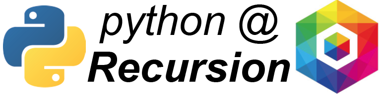
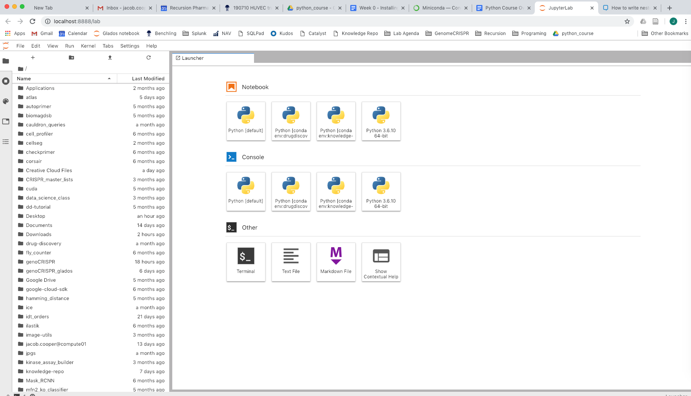

  
# Welcome to set-up week!
Welcome everyone, we are happy that you are joining us to learn python! Before we begin teaching python proper, we need to make sure that we set up our computer’s environments so that everything will run as expected. In this tutorial we will walk through setting up the tools that you will need for the class. If you run into problems, just ping @instructors in the #learning-python channel.  
  
We know that many of you are new to programming in general. If you are ever stuck, or just look at something and say, “I don’t even know where to start with that”, just ask one of us! The instructors have all been doing this for a while, and often we will forget to say explicit steps that are required to do something that we have learned to do implicitly. And all of us know this, because we learned at one time as well, and all remember sneering at some tutorial and saying, “Would have been nice if you had mentioned I had to do that intermediate step.” 

# What do we cover in this section
**Basics of using the terminal.**  
  
**Installing Miniconda**. Miniconda is a version of the package manager, Anaconda. The point of a package manager is to allow you to install programs and utilities from a single, verified source. Miniconda/Anaconda is the one that we use here at Recursion.  
  
**Setting the correct python version**. Python, as an evolving programming language, has had many version releases. Sometimes these are big and change many things (like the switch from Python2 to Python3), but usually these are just small bug fixes and quality of life updates. However, it is still hard to avoid issues that come from version mis-matches. To facilitate any troubleshooting that might come up, we are going to try and set everyone on the same version of python at the start.  
  
**Installing jupyter-lab.** Jupyter-lab (the successor to jupyter-notebooks) have always been a great way to interact with code. You will learn more about this in the tutorial, but basically, jupyter-lab splits code into small cells, so that you can see the output that returns as the result of running a section of code. It also allows you to draw plots and visualize data frames in a simple call and return style. Not only that, but it runs almost identically no matter which operating system you use. To top it off, this isn’t just a teaching tool - it is a tool used by professional data scientists to explore data, and the way that we write Knowledge Repo posts.  
  
**Tutorial on how to use jupyter lab.** We will get to do something other than just install things!  
  
# The Terminal and running commands
To start your terminal:
- Mac : the terminal is called “Terminal” and it’s located in Applications. Cmd+space will bring up search, and you can type “Terminal” to find it that way too.  
- Windows : Your terminal is called “Powershell”. To find it, press the windows key and search for “Powershell”.  
  
The Terminal is a program on your computer that allows you to send commands to your computer. On any given line, you can write a command, press “Enter”, and the program that runs the Terminal will try to interpret and execute that command. The terminal is usually used for pretty basic stuff. Usually we will just be using it to start python, but it might find some other uses. Here are some example commands:  
- `ls` - displays all the files in the specified directory. If no directory is specified, displays all the files in the current directory  
- `cd dir` - changes the current directory to “dir”  
- `mv file1 file2` - moves file1 to file2. Deletes file1.  
- `cp file1 file2` - copies file1 to file2. Does not delete file1  

It is important to remember that when you run commands in the terminal, you have direct control over your computer’s file system. This means that you should be careful not to delete things that you don’t want to delete - there is no “undo” option. To that end, avoid running `rm` unless you really know that you want to do that. For example, `rm -rf *` will delete everything in the directory you are in, and everything in the directories below that. If you run this command from your home directory, you will wipe almost all the data on your computer. That said, all our computers are backed up by IT, so you might lose a day at most if something goes very wrong.  
  
It is possible to configure your terminal to make it look nicer. The way to do so is a bit different for [Mac](https://support.apple.com/guide/terminal/profiles-change-terminal-windows-trml107/mac) vs [Windows](https://beebom.com/how-change-powershell-color-scheme-windows-10/).  
  
## How we will prompt you to run terminal commands.
When we want you to run a command in the Terminal, we will say “Run `command`”. ex. If we say “Run `cd ..` to change directories, you would type “cd ..” into the Terminal and press “Enter”. Note that spaces are very important in terminal commands. `cd..` != `cd ..`. To make sure that this works for everyone, do the following:   
- Open your Terminal, run `ls`  
This should list all the files in your current directory.

## Note to Windows users
To be frank, most of the instructors are much more familiar with MaxOS / Linux based systems. We might miss something from time to time - if this happens, just call it out, and we can slow down and try to fix it. Windows is actually much, much more friendly to python than it used to be - I went through all the processes below on my windows machine at home, and I think it might have actually been easier than when I did it on my Mac. That’s not to say that there won’t be speedbumps. The first one; whenever we refer to “the Terminal”, what we mean for Windows is “Powershell”. Powershell has some but not all the commands of the Mac/Linux Terminal, so from time to time we might have to do some googling to figure out what the equivalent Powershell command might be.  
- Terminal = Powershell	

## Mac Users: You have an extra step
It turns out that Mac’s have an extra step, because we need to install some developer tools. We need to install Xcode, which will provide some behind the scenes libraries that some programs might need. Vague, I know, but the things that require Xcode are sporadic. Here is how to install it, with some [additional detail](https://osxdaily.com/2014/02/12/install-command-line-tools-mac-os-x/) if you get stuck:
- Launch the terminal  
- Run `xcode-select --install`  
- A software prompt will appear, asking you about installing xcode. Select “install”  
- Wait for it to install.  
- To make sure this worked, run `gcc`. The terminal should respond : clang: error: no input files.  

# Download Miniconda
In general, we are going to go download the installer, run the installer, and then make sure that Miniconda is installed correctly with python.  
- Go to the [miniconda site](https://docs.conda.io/en/latest/miniconda.html), and download Python 3.7, 64 bit for your operating system  
- Run the installer program.  
- Make sure to check “Add Miniconda3 to my PATH environment variable” and “Register Miniconda3 as my default Python 3.7”. We are going to change the python version to 3.6 soon, but we want everyone to start from the same point.  
- Click through the install wizard. The default install directory should be just fine.  
- Uncheck the optional tutorial and learn more boxes at the end of the install.  
- Restart your Terminal  
- Run `python --version`. As a general tip, adding “--version” to a command is supported by some commands, and will tell you what version of that command your computer thinks it should run. You should see:  
    - Mac : Python 3.7.6  
    - Windows : Python 3.7.615 :: Anaconda, Inc.  or  Python 3.7.6  
- Run `conda`. You will know if this worked if your computer presents the conda options to you. You know it’s not working if your computer tries to tell you it doesn’t know what “conda” means.  
  
If anything above doesn’t go as expected, don’t continue, contact one of us! We really want to make sure that all of this is correct, or it will create problems in the future.

# Change the default version of python
We are going to use Miniconda to install a different version of python as the default version. Then, we will check that the computer thinks that the new version is the default version.  
- Run `conda install python=3.6.10`  
- When it asks if you want to proceed, type “y” and hit “Enter”.  
- Run `python --version`.  
    - Mac : Python 3.6.10  
    - Windows : Python 3.6.10 :: Anaconda, Inc.  

# Download jupyter-lab
We are going to use Miniconda to install jupyter-lab, and make sure that we can run jupyter-lab.  
- Run `conda install -c conda-forge jupyterlab`  
    - Why is this different from the install command for python? In this case, “install -c” tells us that we need to go look in what Anaconda calls a “channel” for the data for this package. The channel is “conda-forge”, and the package is “jupyterlab”.  
- As with the python install, When it asks if you want to proceed, type “y” and hit “Enter”.  
- To test that this worked, run `jupyter-lab`  

The first time that you do this, a few things might happen.  
First, you might be asked which browser you want to use to open jupyter. If you use Chrome, we would prefer that you select Chrome. However, Chrome, Firefox, or Internet Explorer should all be ok.  
Second, your computer might throw some security warning at you, or an antivirus software might tell you that it is trying to block your attempt. Disable this block (unfortunately depends on your antivirus, but if you can’t figure it out just contact us and we will help!).
If all works correctly, your terminal will start to spit a bunch of text at you. It is starting to run a local server that it will use to host the notebook. Then, a new page of your browser should open with the notebook home screen, which should look something like this (though this will look different for everyone based on the files on your computer):  
  
# Basics of Jupyter-Lab
Once you have all the steps above done, and there haven’t been any errors, go follow along with [this video tutorial](https://www.youtube.com/watch?v=7wfPqAyYADY) (20 min) on jupyter environments. In it they use a web based version of jupyter-lab, so ignore the part about installing and forking their version - instead, start a new notebook by clicking on the Python[default] icon under “Notebook” and just follow along!

Jupyter-lab is an interactive environment for programming that runs in your browser. To run it from your computer, you just go to the terminal run `jupyter-lab`. This tells your computer to start a local server, spin up jupyter-lab on that server, and then hook your browser into that server so you can see what’s happening and interact with it. Within jupyter-lab you open Notebooks, where you can write code and see the output of that code. There are some rules to how the notebooks work that are worth knowing:  
- The server is running from your terminal, so your terminal has to remain open for jupyter-lab to work. There are ways around this, but those are complicated and unnecessary for what we will use it for.  
- When the terminal closes, saved code will remain in the notebooks. However, the current state of the code will be erased - so the variables that you assigned don’t hold their values anymore. All this is to say that when you open the terminal again, you will just need to re-run the saved code to re-generate the variables.  
- When you close a notebook in the browser, it doesn’t actually shut down. To really shut down a notebook without closing your terminal, go to the stop-sign tab on the left, and select “SHUT DOWN” next to the notebook name. You may need to do this from time to time if you have lots of open notebooks that are using up memory.  

# Optional : Download a stand alone code editor
For most everything in the fundamentals section of the course, we will only need jupyter-lab. However, in the future if you want to write scripts and programs, it might be helpful to have a different code editor. There are plenty of options for this, and you might have one that you already like. Personally I like VSCode, as it works the same on every operating system, and is lightweight out of the box but has tons of customization options if you want them.

# That's all!
You are now set up to start coding in python via jupyter lab!
