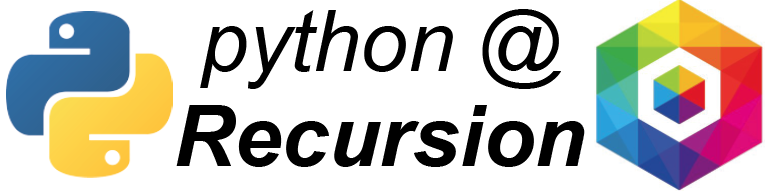

  
# Teaching Python
Python is a powerful, generalizable tool that you can use for many purposes. It is one of the most popular programing languages in the world right now, and that is because of its immense flexibility and applicability to different types of programming. The two main objectives of this course are: 1) Build a broad base of programing knowledge at the company through a shared learning experience and many mentor/mentee relationships. 2) Enable individuals to use python to automate parts of their workflow, build new workflows, and interact with the data systems here at Recursion.

# What are the learning objectives for this course?
- Learn how to set-up python and jupyter notebooks on your machine.
- Learn the generalized framework of computer programming (loops, logic statements, program flow, input/output)
- Write basic programs that automate parts of your workflow
- Manage data sets.
- Plot data,
- Interact with the python-based systems at Recursion.

# General Course Structure
This course will be split into two segments. The first will focus on fundamentals and the second will focus on application. We decided to take this approach given the number of people who are interested in the course, but do not have much previous experience. We are structuring the fundamentals section in a way that should allow for multiple points of entry, and facilitate a learning pace that can match each person based on their experience and time. For those that are looking for some more immediate return on investment, don’t worry - we are going to teach the fundamentals with a healthy dose of examples that should be for day to day work.

## Fundamentals of Python
In this section, learners will work in small groups with a mentor to learn the basics of python. We are going to use a model where learners will work through a common resource on their own, and then come together 2-3 times a week in groups to ask questions, attempt alternative examples, and discuss their progress. We have decided to adopt this method for several reasons:
- Given the remote nature of the course, this will enable everyone to work at a pace that is more suited to their schedule.
- Similarly, this alleviates scheduling for mentors, since with smaller groups it will be easier to find times to talk with everyone.
- There are people of different skill levels starting off, and this will make it easier for mentors to customize the pace to fit the level of the learners.  
  
As the first step of this process, we will spend Week 0 helping everyone set up python and jupyter notebooks on their personal computers. We want most learning to be done in the same environment where learners will apply the knowledge later.

## Applied Python Project
In this section, learners will work one on one or in small groups with a python mentor to identify an area of your workflow where you can apply python, and then to develop a tool for that area. This could take the form of a script or a jupyter notebook that enables the learner(s) to automate part of their workflow, or enables a task that could not be accomplished otherwise. The key to this section is ownership of the final product by the learners - whatever the final product is, it should be something that the learner can update and maintain so that it continues to suit their needs.

# Mentors
Jacob Cooper - jcooper036@gmail.com